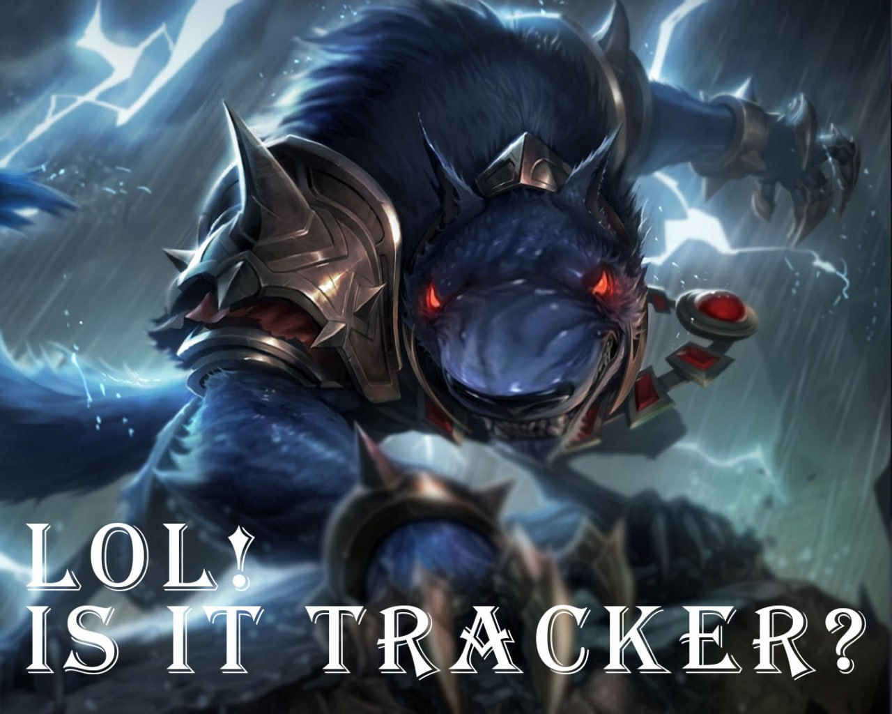
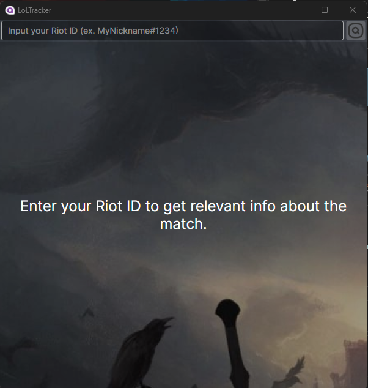
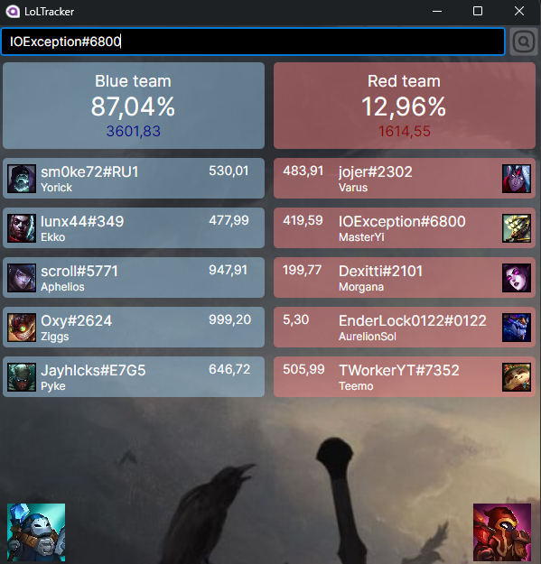

# LoLTracker

LoLTracker is an application that predicts the chances of winning a match in League of Legends based on the past statistics of the players involved.

## Table of Contents

- [Features](#features)
- [Requirements](#requirements)
- [Installation](#installation)
- [Usage](#usage)
- [Examples](#examples)
- [Testing](#testing)
- [Contributing](#contributing)
- [License](#license)
- [Contact](#contact)

## Features

- Requests the user's Riot ID to analyze the current match.
- Displays a table with player performance results.
- Predicts the winning probability for each team.

## Requirements

- A computer or smartphone with an internet connection.
- .NET 8 support.
- Approximately 300 MB of free disk space.

## Installation

1. Download the latest version of the application for Windows or Android from the [releases page of the repository](https://github.com/IOExcept10n/LoLTracker/releases/latest).
2. Install the application by running the downloaded installer.
3. Launch the application like any other application.

## Usage

After installing the application, enter the user's Riot ID to start analyzing the current match. The application will display a table with player performance results and the winning probability for each team.

## Examples

## Research

You can review the code for training the XGBoost models at [this link](https://colab.research.google.com/drive/1xgxKJRh_cY-kkSH8P71WUjl3DWLhLUA8?usp=sharing).

## Contributing

If you would like to contribute, please submit issues and Pull Requests in the repository.

## License

This project is licensed under the MIT License - see the [LICENSE](LICENSE) file for details.

## Contact

You can reach me via email, Telegram, or social media:
- Email: ioexception@outlook.com
- Telegram: [@ioexcept10n](https://t.me/ioexcept10n)
- Any social media from my GitHub profile